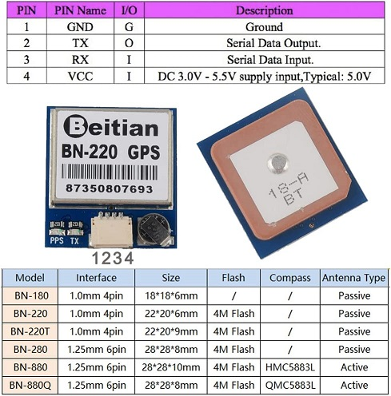
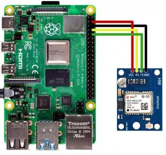

# BN-220 GPIO GPS Module

Small form factor GPS module, works on Pi and Arduino and anything else that can handle serial data in I assume

## GPIO from GPS to Pi

GPIO info for module and Pi. Note that the picture of the pi connecting to the GPS module is *not* BN-220 specific

## Source for Steps

https://maker.pro/raspberry-pi/tutorial/how-to-use-a-gps-receiver-with-raspberry-pi-4

## Purchase Link

https://www.amazon.com/dp/B086ZK9BT4?psc=1&ref=ppx_yo2ov_dt_b_product_details